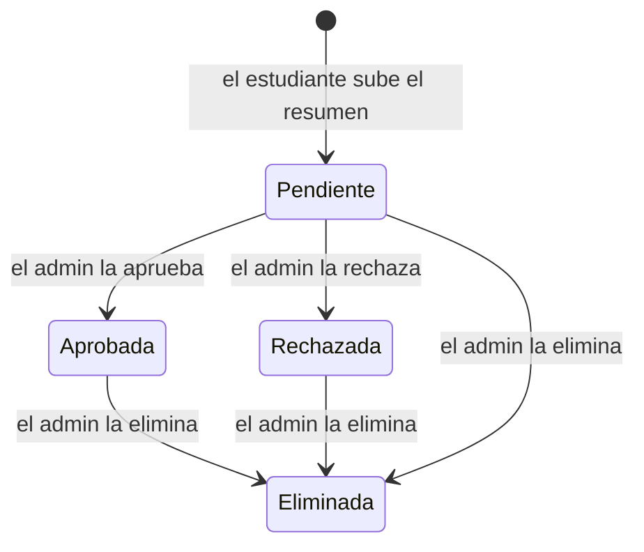

# Estudiario

Plataforma de estudio para estudiantes universitarios, construida como un sistema basado en microservicios para el Práctico Integrador de **Arquitectura de Software 2026** (Facultad de Ingeniería – UCC).

Combina dos partes:

- **Organización personal del estudio.** Cada estudiante carga sus materias, fechas de examen y horas disponibles, y un **agente de IA** le arma el plan de estudio.
- **Foro de resúmenes.** Los estudiantes comparten resúmenes, un administrador los modera antes de publicarlos y el resto de los usuarios los califica.

## Integrantes

| Legajo | Integrante |
|---|---|
| 2405404 | Acuña, Isabela |
| 2417714 | Ainete, Tobías |
| 2418092 | Chamaza, Florencia |
| 2411741 | Silvestrini, Mia |

## Dominio

### Roles

| Rol | Qué puede hacer |
|---|---|
| **Estudiante** | Gestionar sus materias, calendario, disponibilidad y plan de estudio; subir resúmenes al foro; calificar resúmenes publicados |
| **Administrador** | Moderar el foro: aprobar, rechazar o eliminar publicaciones |

### Organización del estudio

Cada estudiante tiene **sus propias materias**, a las que les asigna una **dificultad** (fácil, media, difícil o muy difícil). En su **calendario** carga las fechas importantes de cada materia: parciales, finales, recuperatorios y entregas, con los temas que entran. También declara sus **horas de estudio disponibles**: en qué franjas de la semana puede estudiar y cuántos minutos por día como máximo.

A partir de todo eso, un **agente de IA arma el plan de estudio**. Propone sesiones con fecha, horario, duración, tema y objetivo, y el estudiante las confirma para que queden reservadas en su calendario.

### Foro de resúmenes

Los estudiantes suben **resúmenes** de una materia al foro. Antes de hacerse visible, cada publicación pasa por la **moderación del administrador**:



- Cuando el administrador **aprueba o rechaza** una publicación, el sistema le **envía un mail al autor** avisándole el resultado (y el motivo, si fue rechazada).
- Sólo las publicaciones **aprobadas** son visibles en el foro.
- Los demás estudiantes pueden **calificar** cada resumen publicado. La calificación promedio ayuda a encontrar los mejores resúmenes.

### Acciones principales

| Dominio | Entidad principal | Acción principal | Característica relevante |
|---|---|---|---|
| Planificación de estudio | Examen / sesión de estudio | Confirmar el plan de estudio que arma el agente de IA (reservar sus sesiones) | Las sesiones no pueden superponerse ni superar las horas disponibles del estudiante; una misma confirmación no puede duplicarse; si el examen cambia de fecha, el plan queda desactualizado y hay que replanificarlo |
| Foro de resúmenes | Publicación (resumen) | Moderar una publicación (aprobar / rechazar / eliminar) | La publicación tiene estados con transiciones válidas; cada decisión debe notificarse por mail al autor exactamente una vez; un estudiante califica cada resumen una sola vez |

Ninguna de las dos es una simple alta de registros. La confirmación del plan tiene que validar varias restricciones a la vez, y puede llegar en paralelo desde dos dispositivos o repetirse por un reintento de red. La moderación cambia el estado de la publicación y dispara una notificación por mail que no se puede perder ni duplicar.

## Objetivo

- Que el estudiante no tenga que decidir a mano cuándo estudiar cada materia. El agente de IA propone un plan a partir de las fechas de examen, la dificultad de cada materia, los temas que entran y las horas disponibles. Al confirmarlo, el sistema garantiza que la agenda quede consistente.
- Que los estudiantes puedan compartir y encontrar resúmenes de calidad, con una moderación que evite publicaciones inadecuadas y calificaciones que destaquen los mejores.

## Funcionalidades

- Registro e inicio de sesión, con rol de estudiante o administrador.
- Materias propias de cada estudiante, con su dificultad.
- Calendario con las fechas de exámenes y entregas.
- Disponibilidad: franjas horarias semanales y máximo de minutos de estudio por día.
- Plan de estudio armado por un agente de IA, con confirmación y seguimiento de sesiones.
- Foro de resúmenes: publicación, moderación, búsqueda y calificación.
- Notificación por mail al autor cuando su resumen es aprobado o rechazado.

## Flujo principal

### 1. Plan de estudio

1. **Ingreso.** El estudiante se registra o inicia sesión.
2. **Materias.** Da de alta sus materias con su dificultad.
3. **Calendario.** Carga las fechas de examen de cada materia: tipo, fecha y temas.
4. **Disponibilidad.** Indica sus horas de estudio disponibles: franjas semanales y máximo de minutos por día.
5. **Propuesta del agente de IA.** Pide un plan para un examen y el agente propone sesiones con fecha, horario, duración, tema y objetivo. Por ejemplo: "Leer teoría de Integrales", "Resolver ejercicios", "Simulacro de parcial".
6. **Confirmación.** El estudiante confirma el plan. Las sesiones quedan reservadas en su calendario sólo si:
   - todas caen dentro de sus horas disponibles y antes del examen;
   - ninguna se superpone con otra sesión ya reservada;
   - ningún día supera el máximo de minutos declarado;
   - la confirmación no fue procesada antes (si se repite, se devuelve el mismo resultado en lugar de duplicar sesiones).
7. **Cambios.** Si el examen cambia de fecha o se cancela, el plan pasa a *desactualizado* y las sesiones pendientes se replanifican o se liberan.
8. **Seguimiento.** A medida que estudia, marca cada sesión como completada o pospuesta.

### 2. Foro de resúmenes

1. **Publicación.** El estudiante sube un resumen de una materia y queda *pendiente* de moderación.
2. **Moderación.** El administrador revisa las publicaciones pendientes y aprueba o rechaza cada una. También puede eliminar cualquier publicación.
3. **Notificación.** Al aprobarse o rechazarse, el sistema le envía un mail al autor con el resultado.
4. **Consulta.** Los estudiantes buscan resúmenes aprobados por materia o por texto.
5. **Calificación.** Cada estudiante puede calificar un resumen publicado una sola vez.

## Cómo levantar el sistema

Todo el sistema (servicios, bases de datos y mensajería) se levanta con **un único comando** usando Docker, sin configuraciones manuales.

### Requisitos

- [Docker Desktop](https://www.docker.com/products/docker-desktop/) (incluye Docker Compose v2).
- Git.

### Pasos

```bash
git clone https://github.com/MichiSil/ProyectoEstudiario.git
cd ProyectoEstudiario
cp .env.example .env        # variables locales; los secretos reales nunca se suben al repo
docker compose up --build
```

Para detenerlo:

```bash
docker compose down         # agregar -v para borrar también los datos locales
```

> Los servicios se van incorporando entrega a entrega. Esta sección se actualiza junto con el `docker-compose.yml` cada vez que se suma un componente nuevo, e indicará los puertos y URLs de acceso.

> Las credenciales del proveedor de IA y del servidor de mail se configuran sólo en el `.env` local y nunca se suben al repositorio.

### Entorno desplegado

La capacidad que publicamos para otros grupos va a estar desplegada en la nube con una URL pública. La vamos a publicar acá cuando esté disponible.

## Documentación

| Documento | Contenido |
|---|---|
| [`SPEC.md`](SPEC.md) | Alcance, funcionalidades, reglas de negocio y criterios de aceptación |
| [`docs/ARCHITECTURE.md`](docs/ARCHITECTURE.md) | Arquitectura general, servicios, datos, comunicaciones y diagramas |
| [`docs/adr/`](docs/adr/) | Registro de decisiones arquitectónicas (ADR) |
| [`docs/contracts/`](docs/contracts/) | Contrato versionado de la capacidad publicada para otros grupos |
| [`docs/POSTMORTEM.md`](docs/POSTMORTEM.md) | Informe de la caída controlada |

## Forma de trabajo

- `main` contiene siempre la última versión estable y evaluable.
- Cada tarea se desarrolla en su propia rama (`feature/...`, `docs/...`, `fix/...`) y se integra a `main` con un *pull request* revisado por otra integrante.
