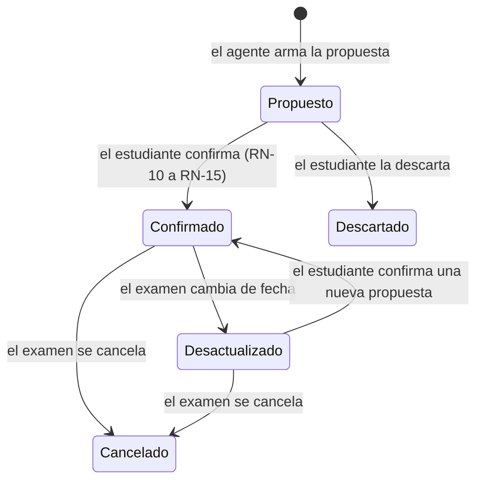
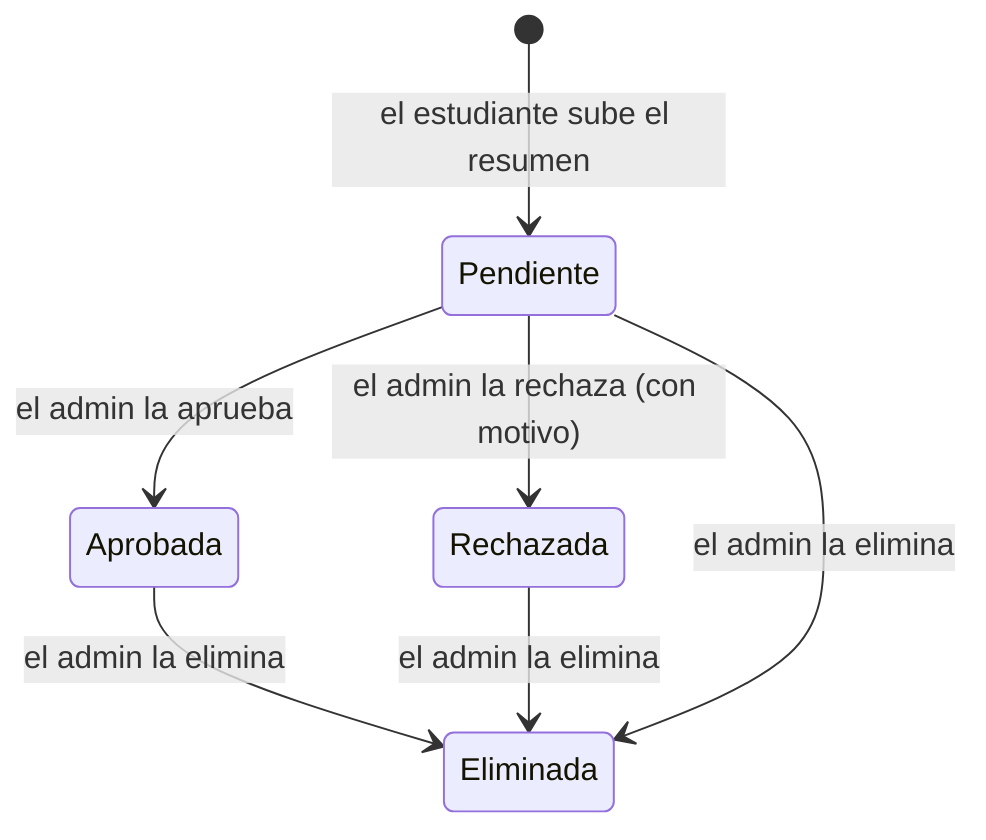

# Especificación de Estudiario

Este documento define **qué** tiene que hacer el sistema: su alcance, las funcionalidades, las reglas de negocio y los criterios de aceptación. **Cómo** se implementa está en [`docs/ARCHITECTURE.md`](docs/ARCHITECTURE.md) y en los [ADR](docs/adr/).

Es un documento vivo: se actualiza en cada entrega a medida que el alcance se precisa.

## 1. Alcance

### 1.1 Incluido

| Área | Qué abarca |
|---|---|
| **Cuentas** | Registro, inicio de sesión y roles (estudiante y administrador). |
| **Organización del estudio** | Materias propias con dificultad, calendario de exámenes y entregas, disponibilidad horaria semanal. |
| **Plan de estudio** | Propuesta de sesiones generada por un agente de IA, confirmación del plan (acción principal), replanificación ante cambios y seguimiento de sesiones. |
| **Foro de resúmenes** | Publicación de resúmenes, moderación por el administrador, búsqueda de resúmenes aprobados y calificación. |
| **Notificaciones** | Mail al autor cuando su resumen es aprobado o rechazado. |
| **Capacidad para otro grupo** | Generar un plan de estudio a partir de un examen y una disponibilidad, a través de un contrato publicado en [`docs/contracts/`](docs/contracts/). |

### 1.2 Fuera de alcance

- Pagos, suscripciones o cualquier tipo de cobro.
- Aplicaciones móviles nativas (el acceso es por la interfaz web).
- Mensajería entre estudiantes o comentarios en los resúmenes.
- Recuperación de contraseña por mail e inicio de sesión con proveedores externos (Google, etc.).
- Edición de un resumen ya moderado: para corregirlo, el autor sube una nueva publicación.
- Integración con calendarios externos (Google Calendar, Outlook).

## 2. Actores

| Actor | Descripción |
|---|---|
| **Estudiante** | Usuario registrado. Gestiona su organización de estudio, pide y confirma planes, sube resúmenes y califica los de otros. |
| **Administrador** | Usuario con rol de moderación. Aprueba, rechaza o elimina publicaciones del foro. |
| **Agente de IA** | Componente del sistema que propone las sesiones de un plan de estudio. No toma decisiones finales: el estudiante siempre confirma. |
| **Sistema externo consumidor** | Sistema de otro grupo que usa la capacidad publicada de generación de planes. |

## 3. Glosario

| Término | Definición |
|---|---|
| **Materia** | Asignatura que cursa un estudiante. Pertenece a un único estudiante y tiene una dificultad. |
| **Dificultad** | Valoración de la materia hecha por el estudiante: 1 fácil, 2 media, 3 difícil, 4 muy difícil. Influye en cuánto antes empieza a estudiarse. |
| **Examen** | Fecha importante de una materia: parcial, final, recuperatorio o entrega. Tiene fecha, hora opcional y temas. |
| **Franja disponible** | Intervalo semanal en el que el estudiante puede estudiar (por ejemplo, lunes de 18:00 a 21:00). |
| **Capacidad diaria** | Máximo de minutos de estudio por día que declara el estudiante. |
| **Sesión de estudio** | Bloque de estudio con fecha, horario, duración, tema y objetivo, asociado a un examen. |
| **Propuesta de plan** | Conjunto de sesiones sugeridas para un examen. Todavía no ocupa lugar en el calendario. |
| **Plan confirmado** | Propuesta aceptada por el estudiante: sus sesiones quedan reservadas en el calendario. |
| **Plan desactualizado** | Plan confirmado cuyo examen cambió de fecha o fue cancelado. |
| **Resumen / publicación** | Material de estudio que un estudiante sube al foro, asociado a una materia. |
| **Moderación** | Decisión del administrador sobre una publicación: aprobarla, rechazarla o eliminarla. |
| **Calificación** | Puntaje de 1 a 5 que un estudiante le da a un resumen aprobado. |

## 4. Convenciones

- **RF-XX**: requisito funcional.
- **RN-XX**: regla de negocio. Es una restricción que el sistema tiene que hacer cumplir siempre, venga de donde venga la operación.
- **CA-XX**: criterio de aceptación, escrito como *Dado / Cuando / Entonces*.

## 5. Cuentas

### 5.1 Requisitos funcionales

| ID | Requisito |
|---|---|
| RF-01 | El estudiante puede registrarse con nombre, mail y contraseña. |
| RF-02 | Un usuario registrado puede iniciar y cerrar sesión. |
| RF-03 | El sistema distingue dos roles: estudiante y administrador. El rol de administrador no se elige al registrarse: se asigna por configuración. |

### 5.2 Reglas de negocio

| ID | Regla |
|---|---|
| RN-01 | No puede haber dos usuarios con el mismo mail. |
| RN-02 | La contraseña tiene como mínimo 8 caracteres y nunca se guarda en texto plano. |
| RN-03 | Cada estudiante sólo puede ver y modificar sus propios datos de estudio (materias, exámenes, disponibilidad, planes y sesiones). |

## 6. Organización del estudio y plan de estudio

### 6.1 Requisitos funcionales

| ID | Requisito |
|---|---|
| RF-04 | El estudiante puede crear, editar, listar y eliminar sus materias, indicando nombre, profesores y dificultad. |
| RF-05 | El estudiante puede cargar exámenes en su calendario: materia, tipo (parcial, final, recuperatorio o entrega), fecha, hora opcional y temas. |
| RF-06 | El estudiante puede cambiar la fecha de un examen o cancelarlo. |
| RF-07 | El estudiante puede declarar su disponibilidad: franjas horarias semanales, capacidad diaria en minutos y duración preferida de cada sesión. |
| RF-08 | El estudiante puede pedir una propuesta de plan para un examen. El agente de IA devuelve sesiones con fecha, horario, duración, tema, objetivo y una explicación de por qué se propusieron así. |
| RF-09 | El estudiante puede confirmar una propuesta de plan. Las sesiones confirmadas quedan reservadas en su calendario. **(Acción principal.)** |
| RF-10 | El estudiante puede ver su calendario con exámenes y sesiones reservadas. |
| RF-11 | El estudiante puede marcar una sesión como completada o pospuesta. |
| RF-12 | Si un plan queda desactualizado, el estudiante puede pedir una nueva propuesta que reemplace las sesiones pendientes. |
| RF-13 | Un sistema externo autorizado puede pedir una propuesta de plan enviando los datos de un examen y una disponibilidad, sin necesidad de tener cuenta de estudiante (capacidad publicada, ver [`docs/contracts/`](docs/contracts/)). |

### 6.2 Reglas de negocio

**Propuesta del plan**

| ID | Regla |
|---|---|
| RN-04 | La fecha de un examen no puede estar en el pasado al momento de cargarlo. |
| RN-05 | Cada franja disponible tiene una hora de inicio anterior a la de fin, y las franjas de un mismo día no se superponen. |
| RN-06 | El estudio de un examen empieza con más anticipación cuanto más difícil es la materia. Valores iniciales: fácil 5 días, media 10, difícil 15 y muy difícil 21. Si faltan menos días, se usa el tiempo que queda. |
| RN-07 | La cantidad de sesiones propuestas crece con la dificultad y con la cantidad de temas. Las últimas sesiones antes del examen son de repaso o simulacro. |
| RN-08 | La propuesta del agente de IA nunca se reserva automáticamente: es sólo una sugerencia hasta que el estudiante la confirma. |
| RN-09 | Si el agente de IA no está disponible, el sistema arma la propuesta con un algoritmo de reglas fijas (RN-06 y RN-07), para que el estudiante pueda seguir planificando. |

**Confirmación del plan (acción principal)**

Un plan sólo se confirma si se cumplen **todas** estas reglas. Si alguna falla, no se reserva ninguna sesión (todo o nada).

| ID | Regla |
|---|---|
| RN-10 | Cada sesión cae completa dentro de una franja disponible del estudiante. |
| RN-11 | Cada sesión termina antes del inicio del examen. |
| RN-12 | Ninguna sesión se superpone con otra sesión ya reservada del mismo estudiante, sea de esta materia o de otra. |
| RN-13 | La suma de minutos reservados en un día no supera la capacidad diaria del estudiante. |
| RN-14 | Una misma confirmación no puede procesarse dos veces. Si llega repetida (por un reintento de red o desde dos dispositivos a la vez), el sistema devuelve el resultado de la primera y no duplica sesiones. |
| RN-15 | Un examen tiene como máximo un plan confirmado vigente. |

**Cambios en el examen**

| ID | Regla |
|---|---|
| RN-16 | Si un examen con plan confirmado cambia de fecha, el plan pasa a *desactualizado*. Sus sesiones pendientes siguen visibles, marcadas como desactualizadas, hasta que el estudiante replanifique. |
| RN-17 | Si un examen se cancela, sus sesiones pendientes se liberan. Las sesiones completadas se conservan como historial. |
| RN-18 | Al replanificar, sólo se reemplazan las sesiones pendientes. Las completadas no se modifican. |

### 6.3 Estados

Una **sesión** confirmada puede estar *pendiente*, *completada* o *pospuesta*. Una sesión pospuesta libera su horario y su tema vuelve a considerarse en la próxima replanificación.

## 7. Foro de resúmenes

### 7.1 Requisitos funcionales

| ID | Requisito |
|---|---|
| RF-14 | El estudiante puede subir un resumen indicando título, materia, descripción y un archivo PDF. |
| RF-15 | El estudiante puede ver el estado de sus propias publicaciones (pendiente, aprobada o rechazada) y, si fue rechazada, el motivo. |
| RF-16 | El administrador puede ver la lista de publicaciones pendientes, ordenadas de la más antigua a la más reciente. |
| RF-17 | El administrador puede aprobar o rechazar una publicación pendiente. Al rechazarla, indica el motivo. |
| RF-18 | El administrador puede eliminar cualquier publicación, esté en el estado que esté. |
| RF-19 | Cualquier estudiante puede buscar resúmenes aprobados por texto (título y descripción), con resultados paginados. |
| RF-20 | La búsqueda permite filtrar por materia y por calificación mínima, y ordenar por relevancia, calificación promedio o fecha de publicación. |
| RF-21 | Cualquier estudiante puede ver el detalle de un resumen aprobado y descargar su archivo. |
| RF-22 | El estudiante puede calificar un resumen aprobado con un puntaje de 1 a 5. |

### 7.2 Reglas de negocio

**Publicación y moderación**

| ID | Regla |
|---|---|
| RN-19 | Toda publicación nueva empieza en estado *pendiente*. |
| RN-20 | El archivo tiene que ser PDF y pesar como máximo 10 MB. |
| RN-21 | Sólo se puede aprobar o rechazar una publicación *pendiente*. Una publicación ya aprobada o rechazada no vuelve a moderarse. |
| RN-22 | Rechazar una publicación exige un motivo. |
| RN-23 | Si dos administradores moderan la misma publicación al mismo tiempo, sólo una decisión es válida. La otra recibe un error indicando que la publicación ya fue moderada. |
| RN-24 | Sólo las publicaciones *aprobadas* aparecen en la búsqueda y en el foro. Una publicación eliminada deja de aparecer, aunque haya estado aprobada. |
| RN-25 | La materia de un resumen es un texto libre (por ejemplo, "Análisis Matemático II"). No depende de las materias personales del autor, para que cualquier estudiante pueda encontrarlo. |

**Búsqueda**

| ID | Regla |
|---|---|
| RN-26 | Un resumen aprobado aparece en la búsqueda en, como máximo, 1 minuto desde su aprobación. Un resumen eliminado deja de aparecer en el mismo plazo. |
| RN-27 | Una página de resultados tiene como máximo 50 resúmenes. |

**Calificación**

| ID | Regla |
|---|---|
| RN-28 | Sólo se califican publicaciones aprobadas. |
| RN-29 | Un estudiante no puede calificar sus propios resúmenes. |
| RN-30 | Cada estudiante califica un resumen una sola vez. Si vuelve a calificarlo, se reemplaza su puntaje anterior: nunca cuenta dos veces. |
| RN-31 | La calificación de un resumen es el promedio de los puntajes recibidos, junto con la cantidad de calificaciones. |

### 7.3 Estados de una publicación

## 8. Notificaciones

### 8.1 Requisitos funcionales

| ID | Requisito |
|---|---|
| RF-23 | Cuando una publicación es aprobada, el sistema le envía un mail al autor avisándole que su resumen fue publicado. |
| RF-24 | Cuando una publicación es rechazada, el sistema le envía un mail al autor con el motivo del rechazo. |

### 8.2 Reglas de negocio

| ID | Regla |
|---|---|
| RN-32 | Cada decisión de moderación genera exactamente un mail: no se puede perder ni enviar duplicado. |
| RN-33 | La moderación no depende del envío del mail. Si el servicio de mail está caído, la publicación queda aprobada o rechazada igual, y el mail se envía cuando el servicio vuelva. |
| RN-34 | Si un mail no puede enviarse después de varios reintentos, queda registrado como fallido para revisarlo, sin bloquear al resto de las notificaciones. |
| RN-35 | La eliminación de una publicación no genera mail. |
