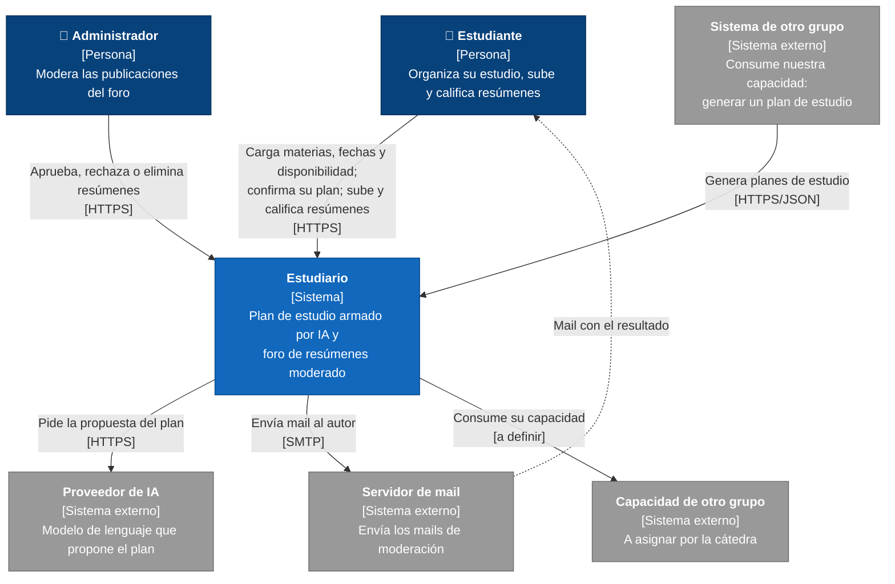
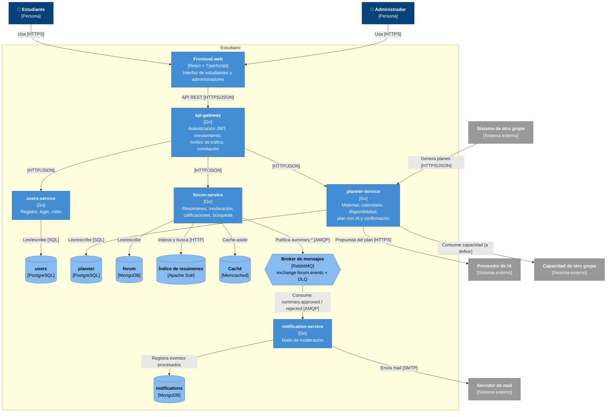

# Arquitectura de Estudiario

> Versión inicial (Entrega 1). Este documento se actualiza en cada entrega junto con el código. Las decisiones que lo justifican están en [`docs/adr/`](adr/).

## 1. Descripción general

Estudiario es una plataforma de estudio para estudiantes universitarios con dos partes:

- **Organización personal del estudio:** cada estudiante carga sus materias (con su dificultad), las fechas de examen, sus horas disponibles, y un agente de IA le arma un plan de estudio que después confirma.
- **Foro de resúmenes:** los estudiantes suben resúmenes, un administrador los aprueba, rechaza o elimina, el autor recibe un mail con el resultado y el resto de los usuarios busca y califica los resúmenes publicados.

El sistema está compuesto por un **frontend web**, un **API gateway** y **cuatro microservicios** escritos en Go. Cada servicio es dueño de sus datos y elige el almacenamiento que mejor se adapta a su forma de uso. Los servicios se comunican de forma **síncrona** (HTTP/REST) cuando el usuario espera una respuesta, y de forma **asíncrona** (eventos por RabbitMQ) para las consecuencias que pueden ocurrir después, como el mail de moderación.

Todo el sistema se levanta localmente con `docker compose up --build` (ver el [README](../README.md)).

## 2. Servicios y responsabilidades

| Componente | Responsabilidad | Tecnología |
|---|---|---|
| **frontend** | Interfaz web: centraliza toda la interacción del estudiante y del administrador. Sólo habla con el api-gateway. | React + TypeScript (Vite) |
| **api-gateway** | Punto de entrada único: valida el JWT, enruta cada request al servicio correspondiente, aplica límites de tráfico y propaga el identificador de correlación. No tiene lógica de negocio. | Go |
| **users-service** | Registro, inicio de sesión, emisión del JWT y roles (`estudiante` / `admin`). | Go + PostgreSQL |
| **planner-service** | Materias del estudiante y su dificultad, calendario de exámenes y entregas, disponibilidad horaria, generación del plan de estudio con el agente de IA, **confirmación del plan** (acción principal) y seguimiento de sesiones. Expone la **capacidad publicada para otros grupos: generar un plan de estudio**. | Go + PostgreSQL |
| **forum-service** | Publicación de resúmenes, **moderación** (aprobar / rechazar / eliminar), calificaciones, búsqueda indexada de resúmenes aprobados y caché del listado. Publica los eventos de moderación. | Go + MongoDB + Apache Solr + Memcached |
| **notification-service** | Consume los eventos de moderación y le envía el mail al autor exactamente una vez. Trata los mensajes que no se pueden procesar. | Go + MongoDB |

Los criterios para separar los servicios están en el [ADR-001](adr/ADR-001-limites-de-servicios.md).

## 3. Propiedad de los datos

Cada entidad tiene **un único servicio dueño**, que es el único que la escribe. **Ningún servicio accede a la base de otro**: cada uno tiene su propia base y su propio usuario.

| Servicio | Datos que administra | Almacenamiento |
|---|---|---|
| users-service | Usuarios, hash de contraseñas, roles | PostgreSQL (base `users`) |
| planner-service | Materias, dificultad, exámenes y eventos del calendario, disponibilidad semanal, planes de estudio, sesiones, claves de idempotencia de las confirmaciones | PostgreSQL (base `planner`) |
| forum-service | Resúmenes y su estado de moderación, calificaciones, eventos pendientes de publicar (*outbox*) | MongoDB (base `forum`) |
| forum-service (derivados) | Índice de búsqueda de resúmenes aprobados; caché del listado y del detalle | Apache Solr; Memcached |
| notification-service | Registro de notificaciones enviadas (para no enviar dos veces el mismo mail) | MongoDB (base `notifications`) |

Cuando un servicio necesita referirse a una entidad de otro, guarda **sólo su identificador** y los datos mínimos que necesita en ese momento. Por ejemplo, el resumen guarda el `authorId` junto con el nombre y el mail del autor al publicarse, así notification-service no tiene que consultar a users-service. La identidad del usuario viaja en el JWT, por lo que planner-service y forum-service tampoco llaman a users-service en cada request.

El detalle de por qué se eligió cada almacenamiento está en el [ADR-003](adr/ADR-003-persistencia.md).

## 4. Comunicación entre componentes

### Síncrona (HTTP/REST + JSON)

| Origen → destino | Para qué |
|---|---|
| frontend → api-gateway | Toda interacción del usuario |
| api-gateway → users / planner / forum | Enrutamiento de cada request |
| planner-service → proveedor de IA | Generar el plan de estudio |
| planner-service → capacidad de otro grupo | A definir cuando la cátedra asigne el proveedor |
| sistema de otro grupo → planner-service | Consumir nuestra capacidad: generar un plan de estudio |

- **No hay llamadas síncronas entre servicios propios**, así se evitan cadenas que sumen latencia y propaguen fallas.
- Toda llamada saliente tiene **timeout** y sólo se **reintentan** operaciones idempotentes ante errores transitorios.
- Si la IA no responde, planner-service arma el plan con su **motor de reglas** (degradación controlada).
- La confirmación del plan usa el encabezado `Idempotency-Key` para que un reintento no duplique sesiones.

### Asíncrona (RabbitMQ)

| Evento | Publica | Consume | Efecto |
|---|---|---|---|
| `summary.approved` | forum-service | notification-service, indexador | Mail al autor; el resumen entra al índice |
| `summary.rejected` | forum-service | notification-service | Mail al autor con el motivo |
| `summary.deleted` | forum-service | indexador | El resumen sale del índice |

- forum-service guarda el evento junto con el cambio de estado (*outbox*) y lo publica después, así no se pierde aunque RabbitMQ esté caído.
- notification-service es **idempotente**: registra el `eventId` antes de enviar y descarta los repetidos.
- Los mensajes que fallan se reintentan con espera y, si no se pueden procesar, van a una **dead letter queue** (`notifications.dlq`).

Los valores concretos de timeouts, reintentos y formato de eventos se documentan en el ADR-005 (D5).

## 5. Diagramas (modelo C4)

Los diagramas siguen el [modelo C4](https://c4model.com/). Se escriben en Mermaid para que GitHub los muestre directamente y se versionen junto con el código.

### 5.1 Diagrama de contexto

Muestra a Estudiario como una caja negra: quién lo usa y con qué sistemas externos se relaciona.

### 5.2 Diagrama de contenedores

Abre la caja de Estudiario: aplicaciones, servicios, almacenamientos y cómo se comunican.

**Cómo leerlo**

- Las líneas que salen del **api-gateway** son síncronas. La única comunicación entre servicios propios es **asíncrona**, a través de RabbitMQ.
- El **sistema de otro grupo** entra directo a planner-service (el servicio dueño de la capacidad), por el punto que se publique para la integración. El frontend propio no participa de esa comunicación.
- **Solr** y **Memcached** son almacenes derivados: si se pierden, se reconstruyen desde MongoDB.
