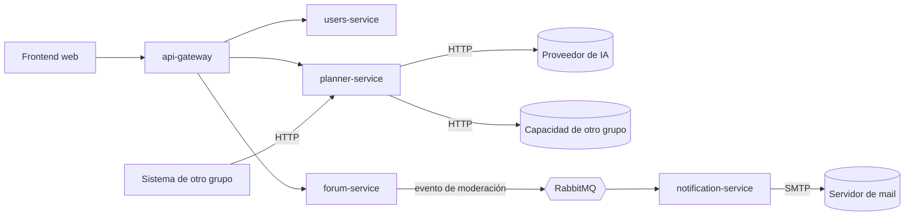

# ADR-001: Límites de los servicios

- **Estado:** Propuesta
- **Fecha:** 2026-10-07
- **Decisión del enunciado:** D1
- **Reemplaza a:** —

## Contexto

Estudiario combina dos partes con necesidades muy distintas:

- **Organización personal del estudio:** materias, calendario, disponibilidad y un plan de estudio que arma un agente de IA. Los datos son privados de cada estudiante y la operación crítica (confirmar el plan) exige consistencia fuerte: no puede haber sesiones superpuestas, días sobrecargados ni confirmaciones duplicadas.
- **Foro de resúmenes:** contenido compartido entre todos los estudiantes, moderado por un administrador y calificado por los usuarios. Es mayoritariamente de lectura, necesita búsqueda por texto y cada decisión de moderación tiene que notificarse por mail al autor.

El enunciado exige al menos tres microservicios y un API gateway, y que cada servicio sea dueño de sus datos. Además, el sistema depende de dos proveedores externos que pueden fallar o responder lento: el proveedor de IA y el servidor de mail.

## Criterios utilizados para separar responsabilidades

1. **Capacidad de negocio:** cada servicio responde a una pregunta del dominio ("¿quién es el usuario?", "¿cuándo estudio?", "¿qué resúmenes hay?", "¿a quién aviso?").
2. **Propiedad de los datos:** cada entidad tiene un único servicio dueño, que es el único que la escribe. Ningún servicio accede a la base de otro.
3. **Patrones de acceso y consistencia distintos:** lo que necesita transacciones y restricciones fuertes queda separado de lo que es de lectura masiva y búsqueda.
4. **Aislamiento de fallas:** una dependencia externa caída (IA o mail) no debe impedir usar el resto del sistema.
5. **Tamaño manejable para el equipo:** cuatro integrantes. Se evita partir en servicios tan chicos que el costo de coordinarlos supere el beneficio.

## Opciones consideradas

1. **Monolito modular.** Un único despliegue con módulos internos. Es simple de construir y de operar, pero no cumple el requisito de microservicios y una falla del mail o de la IA afectaría a todo el proceso.
2. **Servicios muy granulares** (materias, calendario, disponibilidad, sesiones, publicaciones, calificaciones, búsqueda y moderación por separado). Los límites quedarían muy finos, pero la confirmación del plan necesitaría coordinar datos de varios servicios (transacciones distribuidas o sagas) justo en la operación que exige consistencia fuerte. Además, es demasiado para el tamaño del equipo.
3. **Un servicio por parte del dominio, más identidad y notificaciones (elegida).** Cinco componentes: el gateway y cuatro servicios.

## Decisión

El backend se divide en un **API gateway** y **cuatro microservicios**:

| Componente | Responsabilidad | Datos de los que es dueño |
|---|---|---|
| **api-gateway** | Punto de entrada único del frontend: valida el JWT, enruta a cada servicio, aplica límites de tráfico y propaga el identificador de correlación. No tiene lógica de negocio. | — |
| **users-service** | Registro, inicio de sesión, emisión de JWT y roles (`estudiante` / `admin`). | Usuarios, credenciales (hash), roles |
| **planner-service** | Materias propias con su dificultad, calendario de exámenes y entregas, disponibilidad horaria, plan de estudio armado por el agente de IA, confirmación del plan (acción principal) y seguimiento de sesiones. Expone la **capacidad publicada para otros grupos: generar un plan de estudio**. | Materias, exámenes/eventos, disponibilidad, planes, sesiones de estudio, claves de idempotencia de confirmaciones |
| **forum-service** | Publicación de resúmenes, moderación (aprobar, rechazar, eliminar), calificaciones, búsqueda indexada de resúmenes aprobados y caché del listado. Publica los eventos de moderación. | Resúmenes y su estado, calificaciones, índice de búsqueda |
| **notification-service** | Consume los eventos de moderación y envía el mail al autor exactamente una vez. Trata los mensajes que no se pueden procesar. | Registro de notificaciones enviadas (para idempotencia) |

### Relaciones entre servicios

- El frontend sólo habla con el **api-gateway**.
- Los servicios **no comparten base de datos**. Cuando un servicio necesita referirse a una entidad de otro, guarda sólo su identificador (por ejemplo, `authorId` en un resumen) y los datos mínimos que necesita en ese momento (por ejemplo, el nombre y el mail del autor al publicar), sin consultarlo en cada operación.
- La **identidad viaja en el JWT**: el gateway lo valida y los servicios leen el `userId` y el rol de los claims. Por eso planner-service y forum-service no llaman a users-service en cada request.
- **forum-service y notification-service se comunican de forma asíncrona.** La moderación termina aunque el servidor de mail esté caído, y el mail se envía cuando se recupere.
- **planner-service es el único que habla con el proveedor de IA.** Si la IA falla, el plan se arma con el motor de reglas (degradación controlada), y el foro no se entera.
- La **capacidad de otro grupo** se consume desde el servicio responsable de la funcionalidad que la usa, nunca desde el frontend ni a través del gateway propio. Va a quedar definida en el ADR-009 cuando la cátedra asigne el proveedor.

### Decisiones de límite que vale la pena explicitar

- **La búsqueda queda dentro de forum-service** y no en un servicio aparte. El índice (Apache Solr) es infraestructura del servicio dueño de los resúmenes. Separarla no aportaría aislamiento real (busca sobre los mismos datos) y sumaría un servicio más para construir y operar. Si más adelante la carga de búsqueda lo justifica, se extrae y se registra en un ADR que reemplace a este.
- **El agente de IA no es un servicio propio.** Es un componente de planner-service, detrás de una interfaz, porque generar el plan necesita los datos que planner-service ya tiene (materias, exámenes, disponibilidad) y su resultado se valida con las mismas reglas que la confirmación.
- **Las materias del foro no son las materias del estudiante.** En planner-service cada estudiante tiene *sus* materias. En el foro, el resumen guarda el nombre de la materia como etiqueta propia. Así se evita que forum-service dependa de planner-service para mostrar o buscar resúmenes.
- **La moderación queda en forum-service**, junto con los resúmenes, porque es una transición del estado de la publicación y tiene que ser atómica con él.

## Consecuencias

**Positivas**

- La confirmación del plan es una operación **local** de planner-service: todas sus validaciones se resuelven en una única transacción, sin coordinación distribuida.
- Las fallas de proveedores externos quedan contenidas: si cae el mail, sólo se demora la notificación; si cae la IA, sólo se degrada la generación del plan.
- Cada servicio puede elegir el almacenamiento que mejor se adapta a sus datos (ver [ADR-003](ADR-003-persistencia.md)).
- Los límites coinciden con la forma de repartir el trabajo entre los integrantes.

**Negativas / limitaciones aceptadas**

- Los datos copiados (nombre y mail del autor en el resumen, nombre de la materia) pueden quedar desactualizados si el usuario los cambia. Se acepta porque no afectan reglas de negocio.
- Hay más piezas para levantar y observar que en un monolito: requiere `docker compose`, logs correlacionados y trazas desde el inicio.
- planner-service concentra bastante lógica (materias, calendario, disponibilidad, plan). Si crece demasiado, se puede revisar la separación de materias y calendario.

**A validar en la Entrega 2**

- Que ninguna operación del flujo principal necesite llamadas síncronas en cadena entre servicios propios.
- Qué capacidad externa se consume y desde qué servicio (ADR-009).
