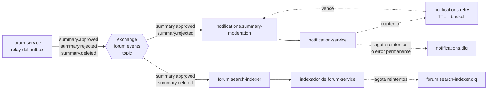

# ADR-005: Comunicación entre servicios

- **Estado:** Propuesta (versión inicial, se valida en la Entrega 2)
- **Fecha:** 2026-10-07
- **Decisión del enunciado:** D5
- **Reemplaza a:** —

## Contexto

Según el [ADR-001](ADR-001-limites-de-servicios.md), Estudiario tiene un api-gateway y cuatro servicios que no comparten base de datos. La sección 4 de [`ARCHITECTURE.md`](../ARCHITECTURE.md) ya fija el criterio general: **síncrono** cuando alguien espera la respuesta, **asíncrono** para las consecuencias que pueden ocurrir después, y **ninguna llamada síncrona entre servicios propios**. Este ADR completa esa sección con los valores concretos: timeouts, reintentos, formato de los eventos e idempotencia.

El enunciado pide que, para la comunicación síncrona, se definan el timeout, el manejo de errores, qué pasa con las respuestas tardías o ausentes y la política de reintentos. Para la asíncrona, pide publicar y consumir un evento de dominio y tratar los mensajes fallidos.

Las restricciones del dominio que más pesan son:

- **RN-09:** si la IA no responde, el plan se arma igual con el motor de reglas.
- **RN-14:** una confirmación de plan repetida no puede duplicar sesiones.
- **RN-26:** un resumen aprobado aparece en la búsqueda en, como máximo, 1 minuto, y uno eliminado deja de aparecer en el mismo plazo.
- **RN-32 a RN-34:** cada decisión de moderación genera exactamente un mail; la moderación no depende del servidor de mail, y un mail que falla en todos sus reintentos queda registrado como fallido sin bloquear a los demás.

## Opciones consideradas

**Estilo de comunicación**

1. **Todo síncrono.** Por ejemplo, forum-service llamaría a notification-service por HTTP al moderar. Es simple de seguir, pero acopla la moderación a la disponibilidad del mail (contradice RN-33) y encadena latencias y fallas.
2. **Síncrono para pedidos del usuario y asíncrono para consecuencias (elegida).** El usuario recibe la respuesta de un único servicio, y lo que puede pasar después (mail, indexación) viaja como evento.
3. **Todo asíncrono, incluso entre gateway y servicios** (pedido y respuesta por colas). Desacopla al máximo, pero complica el manejo de errores en la interfaz y no aporta nada a operaciones en las que el usuario igual espera la respuesta.

**Publicación confiable de eventos en forum-service**

1. **Publicar a RabbitMQ después de guardar el cambio.** Si el proceso se cae entre las dos escrituras, o si RabbitMQ no está disponible, el evento se pierde (contradice RN-32).
2. **Colección de *outbox* separada en la misma transacción.** En MongoDB, una transacción de varios documentos exige un *replica set*, lo que suma complejidad al entorno local.
3. ***Change streams* de MongoDB.** También exigen un *replica set* y atan la publicación a un mecanismo específico del motor.
4. ***Outbox* dentro del mismo documento del resumen (elegida).** El cambio de estado y el evento pendiente se escriben en **una sola operación atómica** sobre un único documento, que MongoDB garantiza sin transacciones de varios documentos (ver [ADR-003](ADR-003-persistencia.md)).

**Broker**

1. **Kafka.** Ofrece retención y reprocesamiento, pero es más pesado de operar y no tiene *dead letter queues* propias.
2. **RabbitMQ (elegida).** Se trabajó en clase. Tiene *exchanges* por tema, confirmación de publicación, colas durables y *dead lettering* incorporado, y alcanza holgadamente para el volumen del sistema.

## Decisión

### 1. Mapa de comunicaciones

| Origen → destino | Tipo | Protocolo | Para qué |
|---|---|---|---|
| frontend → api-gateway | Síncrona | HTTPS/JSON | Toda interacción del usuario |
| api-gateway → users / planner / forum | Síncrona | HTTP/JSON | Enrutamiento de cada pedido |
| planner-service → proveedor de IA | Síncrona | HTTPS/JSON | Generar la propuesta del plan |
| sistema de otro grupo → planner-service | Síncrona | HTTPS/JSON | Capacidad publicada (ver [contrato](../contracts/README.md) y [ADR-008](ADR-008-contrato-propio.md)) |
| planner-service → capacidad de otro grupo | Síncrona | A definir | Se define en el ADR-009 cuando la cátedra asigne el proveedor |
| forum-service → RabbitMQ → notification-service | Asíncrona | AMQP | Mail al autor ante `summary.approved` y `summary.rejected` |
| forum-service → RabbitMQ → indexador de forum-service | Asíncrona | AMQP | Mantener el índice de Solr ante `summary.approved` y `summary.deleted` |

No hay llamadas síncronas entre servicios propios: cada pedido del usuario lo resuelve un único servicio, con sus propios datos y la identidad que viaja en el JWT.

### 2. Comunicación síncrona

#### 2.1 Tiempos de espera y reintentos

| Llamada | Timeout | Reintentos | Si falla o no responde a tiempo |
|---|---|---|---|
| frontend → api-gateway | 15 s (25 s para subir un PDF) | Sólo `GET`, 1 vez, ante error de red | La interfaz muestra un error recuperable y permite reintentar. Las confirmaciones de plan se reintentan con la misma `Idempotency-Key`. |
| api-gateway → users-service | 3 s | Sólo `GET`/`HEAD`, 1 vez, ante error de conexión, `502` o `503` | `503 UPSTREAM_UNAVAILABLE` o `504 UPSTREAM_TIMEOUT` |
| api-gateway → planner-service | 5 s; **12 s** para pedir una propuesta de plan | Igual que la fila anterior | Igual que la fila anterior |
| api-gateway → forum-service | 5 s; **20 s** para subir un PDF | Igual que la fila anterior | Igual que la fila anterior |
| planner-service → proveedor de IA | **8 s de presupuesto total**: un intento de hasta 6 s y, como mucho, un reintento | 1 reintento, sólo si el primer intento falló rápido (error de conexión, `429` o `5xx`) y quedan al menos 3 s del presupuesto. Espera de 300 ms ± 20 %. | Se arma la propuesta con el motor de reglas (RN-09) y se marca `generatedBy: reglas` |
| sistema de otro grupo → planner-service | planner-service responde en menos de **10 s** (8 s de la IA + motor de reglas) | Los decide el consumidor; le recomendamos timeout de 12 s y hasta 3 reintentos con la misma `Idempotency-Key` | Ver la tabla de errores del [contrato](../contracts/README.md#8-errores) |

Criterios detrás de los valores:

- **Los timeouts se escalonan de afuera hacia adentro.** Cada capa espera un poco más que la que tiene detrás: el frontend (15 s) espera más que el gateway (12 s para la propuesta), y el gateway más que el presupuesto de planner-service (10 s). Así la capa interna siempre tiene tiempo de responder con su degradación (por ejemplo, el plan por reglas) antes de que la externa abandone el pedido.
- **Sólo se reintentan operaciones idempotentes.** El gateway nunca reintenta un `POST`, `PUT`, `PATCH` ni `DELETE`, porque no sabe si el servicio llegó a aplicar el cambio. Los reintentos de escrituras los hace el cliente, con `Idempotency-Key`, que es quien sabe que se trata del mismo pedido.
- **A lo sumo un reintento por salto.** Los reintentos se multiplican cuando hay varias capas (3 reintentos en 3 capas son hasta 27 llamadas). Con un único reintento, y sólo en el gateway para lecturas, una caída no se amplifica.
- **La llamada a la IA tiene un presupuesto total**, no un timeout por intento: el reintento sólo se hace si entra dentro de los 8 s.

#### 2.2 Manejo de errores

- El gateway traduce las fallas de los servicios a errores uniformes en formato *Problem Details* (RFC 9457), con un `code` estable y el `correlationId`:
  - el servicio no responde dentro del timeout: `504 UPSTREAM_TIMEOUT`;
  - no se puede conectar o responde `502` o `503` después del reintento: `503 UPSTREAM_UNAVAILABLE`;
  - los errores `4xx` del servicio se devuelven tal cual, porque son errores del pedido y no del sistema.
- Cada servicio distingue **errores del pedido** (`4xx`, no se reintentan) de **errores transitorios** (`5xx`, timeouts y errores de red, que se pueden reintentar).
- Una falla de la IA **no es un error** para quien pide el plan: es una degradación controlada (RN-09) que se informa en la respuesta.

#### 2.3 Respuestas tardías o ausentes

- Toda llamada saliente usa un `context.Context` con *deadline*. Cuando vence, se cancela la llamada, se descarta cualquier respuesta que llegue después y se corta el trabajo pendiente (por ejemplo, las consultas a la base que respetan el contexto).
- Una **respuesta tardía de la IA** se descarta: la propuesta ya se armó con el motor de reglas y no se mezclan las dos.
- **Escritura que se completó pero cuya respuesta no llegó:** el cliente no sabe si se aplicó. Por eso las operaciones que no se pueden duplicar exigen `Idempotency-Key`, y el reintento devuelve el resultado ya guardado en lugar de repetir el efecto.
- Los servidores HTTP en Go configuran `ReadHeaderTimeout`, `ReadTimeout`, `WriteTimeout` e `IdleTimeout`, para que un cliente lento no retenga conexiones indefinidamente.

#### 2.4 Idempotencia en la comunicación síncrona

| Operación | Mecanismo | Alcance y vigencia |
|---|---|---|
| Confirmar un plan (RF-09, RN-14) | Encabezado `Idempotency-Key` obligatorio. La clave se guarda con `UNIQUE` en la misma transacción que reserva las sesiones (ver [ADR-003](ADR-003-persistencia.md)). Un reintento devuelve el resultado de la primera confirmación. | Por estudiante. Se conserva junto con el plan. |
| Generar un plan desde otro sistema (RF-13) | Encabezado `Idempotency-Key` obligatorio. Se guarda la respuesta para devolver la misma propuesta ante un reintento. | Por API key, durante 24 h (ver [ADR-008](ADR-008-contrato-propio.md)). |
| Moderar una publicación (RN-23) | Actualización condicional: sólo pasa a `aprobada` o `rechazada` si está `pendiente`. Una segunda moderación recibe `409` "ya moderada". | — |
| Calificar un resumen (RN-30) | *Upsert* sobre el índice único `(summaryId, userId)`: repetir la calificación reemplaza el puntaje. | — |
| Lecturas (`GET`) | Idempotentes por definición. | — |

Las demás altas (crear una materia, subir un resumen) no llevan clave de idempotencia en esta versión: ni el gateway ni el frontend las reintentan automáticamente. Se acepta que un doble clic pueda crear un duplicado, que el estudiante puede borrar.

#### 2.5 Correlación

El gateway genera un `X-Correlation-Id`, o respeta el que recibe, y lo propaga a cada servicio. Los servicios lo incluyen en sus logs, en las llamadas salientes y en los eventos que publican. La estrategia completa de logs, métricas y trazas se define en el ADR-011 (D11).

### 3. Comunicación asíncrona

#### 3.1 Topología en RabbitMQ



| Elemento | Tipo | Detalle |
|---|---|---|
| `forum.events` | *Exchange* `topic`, durable | Único *exchange* de eventos de forum-service. La *routing key* es el tipo de evento. |
| `notifications.summary-moderation` | Cola durable | Enlazada a `summary.approved` y `summary.rejected`. La consume notification-service. |
| `forum.search-indexer` | Cola durable | Enlazada a `summary.approved` y `summary.deleted`. La consume el indexador, que es parte de forum-service (ver [ADR-001](ADR-001-limites-de-servicios.md)). |
| `notifications.retry` | Cola durable sin consumidores | Cola de espera: cada mensaje tiene un TTL igual a su espera de reintento y, al vencer, vuelve a `notifications.summary-moderation`. Así la espera no bloquea a las demás notificaciones (RN-34). |
| `notifications.dlq` | Cola durable | Mensajes que no se pudieron procesar (ver 3.5). |
| `forum.search-indexer.dlq` | Cola durable | Lo mismo para el indexador. |

Los mensajes se publican como persistentes (`delivery_mode = 2`), con confirmación del broker (*publisher confirms*), y se consumen con confirmación manual (`ack` después de procesar) y un `prefetch` de 10.

Para publicar y consumir se usa la librería de RabbitMQ trabajada en clase (CLASE_4), que implementa los reintentos con *backoff* exponencial.

#### 3.2 Formato de los eventos

Todos los eventos comparten un sobre común, en JSON:

```json
{
  "eventId": "6f1d2b9e-3c4a-4e8b-9f0a-1b2c3d4e5f60",
  "eventType": "summary.rejected",
  "eventVersion": 1,
  "occurredAt": "2026-10-20T14:03:11Z",
  "producer": "forum-service",
  "correlationId": "c0a8012e-7f3b",
  "data": {
    "summaryId": "6650f1c2a9e4b3d2c1a0f9e8",
    "title": "Resumen de integrales dobles",
    "subject": "Análisis Matemático II",
    "author": { "id": "u-123", "name": "Ana Pérez", "email": "ana@example.com" },
    "moderatedBy": "u-001",
    "moderatedAt": "2026-10-20T14:03:11Z",
    "reason": "El PDF está incompleto: faltan las páginas 3 a 5."
  }
}
```

| Evento | Cuándo se emite | `data` |
|---|---|---|
| `summary.approved` | Una publicación pasa de `pendiente` a `aprobada` | `summaryId`, `title`, `subject`, `author` (id, nombre y mail), `moderatedBy`, `moderatedAt` |
| `summary.rejected` | Una publicación pasa de `pendiente` a `rechazada` | Lo mismo que `summary.approved`, más `reason` |
| `summary.deleted` | El administrador elimina una publicación, en cualquier estado | `summaryId`, `deletedBy`, `deletedAt` (no genera mail, RN-35) |

- **`eventId`** es un UUID v4 que se genera al momento del cambio de estado y viaja también como `message_id` de AMQP. Es la clave de idempotencia de los consumidores.
- **`eventVersion`** permite evolucionar el formato. Agregar campos es compatible y no cambia la versión, así que los consumidores ignoran los campos que no conocen. Quitar o cambiar un campo implica una nueva versión, y durante la transición se publican las dos.
- El evento lleva los datos que necesita notification-service para escribir el mail (nombre y mail del autor copiados al publicar, según el [ADR-001](ADR-001-limites-de-servicios.md)), así no consulta a otro servicio.
- El indexador **no confía en el contenido del evento**: lo usa como aviso y relee el documento actual en MongoDB. Si el resumen está `aprobado`, lo indexa; si no, lo saca del índice. Así el orden de llegada de los eventos no importa.

#### 3.3 Publicación: *outbox* dentro del documento

1. Al moderar, forum-service hace **una única actualización atómica y condicional** sobre el documento del resumen: cambia el estado solamente si está `pendiente` (RN-21, RN-23) y, en la misma operación, agrega el evento a un arreglo `outbox` del documento, con `publishedAt: null`.
2. Un proceso de *relay* dentro de forum-service revisa cada **1 s** los documentos con eventos sin publicar (índice sobre `outbox.publishedAt`), los publica en `forum.events` y, cuando el broker confirma, marca `publishedAt`.
3. Si RabbitMQ está caído, los eventos quedan en el *outbox* y el *relay* reintenta con espera exponencial (1 s, 2 s, 4 s…, hasta 30 s entre intentos). La moderación nunca espera al broker (RN-33).
4. Si el proceso se cae después de publicar y antes de marcar `publishedAt`, el evento se publica de nuevo. La entrega es **al menos una vez**, y los consumidores descartan los duplicados por `eventId`.

En condiciones normales, un evento llega al broker entre 1 y 2 s después de la moderación, lo que deja margen para el plazo de 1 minuto de RN-26.

#### 3.4 Consumo idempotente en notification-service

notification-service registra cada evento en la colección `sent_notifications`, con índice único sobre `eventId` y un estado (`procesando`, `enviado` o `fallido`):

1. Al recibir un mensaje, intenta insertar `{eventId, estado: procesando}`.
2. Si el `eventId` ya existe con estado `enviado`, es un duplicado: hace `ack` y lo descarta sin mandar el mail.
3. Si no, envía el mail por SMTP con un timeout de 10 s, marca el registro como `enviado` y recién después hace `ack`.

Queda una ventana mínima en la que el mail se envió pero el proceso se cayó antes de marcar `enviado`. En ese caso, la reentrega produce un segundo mail. Se acepta, porque lo contrario (marcar antes de enviar) arriesga **perder** el mail, y RN-32 considera peor la pérdida que el duplicado. La ventana se mide en la Entrega 2.

#### 3.5 Mensajes fallidos

| Tipo de error | Ejemplos | Tratamiento |
|---|---|---|
| **Transitorio** | El servidor SMTP no responde o rechaza temporalmente (`4xx`); MongoDB no disponible | Reintento con espera exponencial: **5 s, 15 s, 45 s, 2 min 15 s y 6 min 45 s** (± 20 %). Son 5 reintentos en unos 10 minutos. El mensaje espera en `notifications.retry`, con el número de intento en el encabezado `x-retry-count`, sin frenar a los demás. |
| **Permanente** | JSON inválido, `eventType` o `eventVersion` desconocidos, faltan campos, dirección de mail inexistente (SMTP `5xx`) | Va directo a `notifications.dlq`, sin reintentos. |
| **Reintentos agotados** | El servidor de mail sigue caído después de los 5 reintentos | Va a `notifications.dlq` y el registro queda como `fallido` (RN-34). |

- Los mensajes de la DLQ conservan el motivo y la cantidad de intentos. Cuando se resuelve la causa (por ejemplo, vuelve el servidor de mail), se **reinyectan** a la cola principal, y la idempotencia por `eventId` garantiza que no se dupliquen los mails ya enviados (CA-26).
- La cantidad de mensajes en cada DLQ es una métrica con alerta (ADR-011).
- El indexador usa la misma política, con esperas más cortas (1 s, 2 s, 4 s, 8 s y 16 s) para respetar el plazo de 1 minuto de RN-26, y su DLQ es `forum.search-indexer.dlq`. Como el índice es derivado, además se reconcilia periódicamente con MongoDB; el detalle va en el ADR-006 (D6).

## Consecuencias

**Positivas**

- La moderación termina aunque el mail o RabbitMQ estén caídos, y ningún evento se pierde porque queda guardado en el mismo documento que el cambio de estado.
- Un reintento de red nunca duplica sesiones de un plan, propuestas para otro grupo, calificaciones ni mails ya enviados.
- Los timeouts escalonados garantizan que la degradación (plan por reglas) llegue al usuario antes de que una capa externa abandone el pedido.
- Los mensajes fallidos no se pierden ni bloquean a los demás: esperan en una cola de reintento o quedan en una DLQ observable y reprocesable.

**Negativas / limitaciones aceptadas**

- La entrega de eventos es **al menos una vez**: todo consumidor tiene que ser idempotente.
- Existe una ventana mínima en la que un mail puede enviarse dos veces (se prefiere al riesgo de perderlo).
- El *relay* del *outbox* agrega hasta 1 s de demora y una consulta periódica a MongoDB. Si forum-service corre en varias instancias, un mismo evento puede publicarse más de una vez, lo que los consumidores ya toleran.
- Si el servidor de mail está caído más de unos 10 minutos, los mails quedan en la DLQ y hay que reinyectarlos. No se envían solos al volver el servicio.
- Las altas comunes (materias, resúmenes) no tienen idempotencia y un doble envío puede duplicarlas.

**A validar en la Entrega 2**

- Medir la latencia real del proveedor de IA y ajustar el presupuesto de 8 s, y evaluar un *circuit breaker* que la omita directamente cuando falla seguido (ADR-010, D10).
- Que la librería de RabbitMQ de clase permita reintentos diferidos mediante la cola de espera, sin bloquear el consumo.
- Medir el tiempo entre una aprobación y su aparición en la búsqueda, contra el plazo de 1 minuto de RN-26.
- Definir la comunicación con la capacidad del otro grupo (ADR-009, D9).
